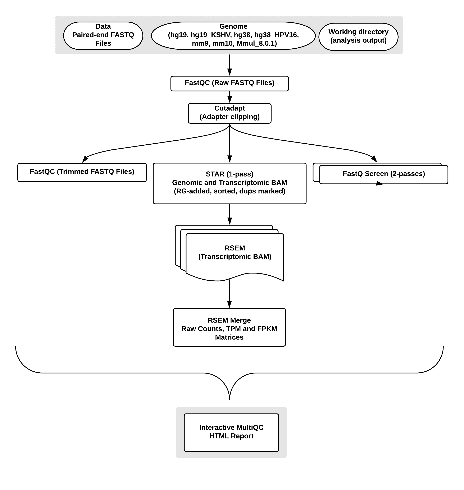
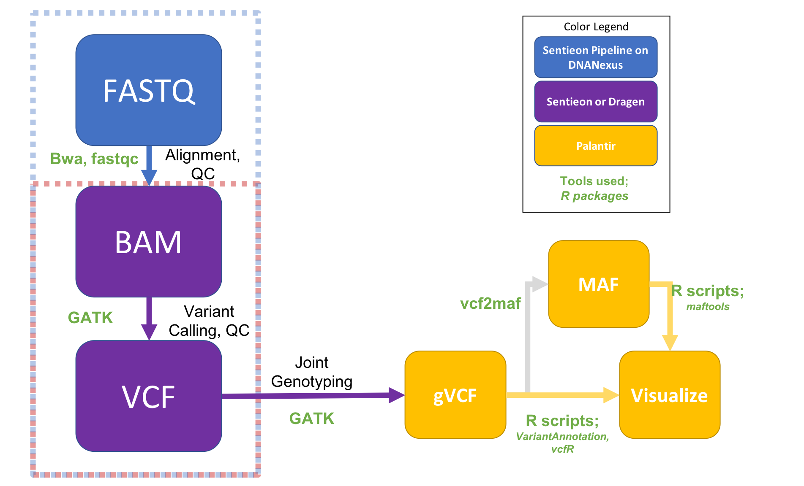

# CCBR DNAnexus Workflows

## Table of Contents
> 1. **[RNA-seq](#1-RNA-seq)**
> 2. **[ChIP-seq](#2-ChIP-seq)**
> 3. **[EXOME-seq](#3-Exome-seq)**

##### Description: 
These workflows provides access to some of the NGS pipelines used and developed by CCBR on Biowulf. They allow the user to select a set of fastq files, and process them on DNAnexus platform to reach an endpoint, such as a list of mutations with accompanying annotations, a set of annotated peaks, or a raw counts matrix.  
 
## 1. RNA-seq 
Overview of the RNA-seq pipeline:
1. [`FastQC`](https://www.bioinformatics.babraham.ac.uk/projects/fastqc/): a quality control tool for high throughput sequence data, written by Simon Andrews at the Babraham Institute in Cambridge. It provides a modular set of analyses which can be used to give a quick impression of whether your data has any problems of which you should be aware before doing any further analysis.
2. [`Cutadapt`](https://cutadapt.readthedocs.io/en/stable/): a tool to find and remove adapter sequences, primers, poly-A tails and other types of unwanted sequence from your high-throughput sequencing reads. Cutadapt is being used to remove adapter sequences.
3. [`FastQ Screen`](https://www.bioinformatics.babraham.ac.uk/projects/fastq_screen/): a tool to screen a library of sequences against a set of sequence databases so one can see if the composition of the library matches with what is expected.
4. [`STAR`](https://www.ncbi.nlm.nih.gov/pmc/articles/PMC3530905/): an ultrafast universal RNA-seq aligner.
5. [`RSEM`](https://bmcbioinformatics.biomedcentral.com/articles/10.1186/1471-2105-12-323): quantifies gene and isoform expression levels from RNA-Seq data.
6. [`MultiQC`](https://multiqc.info/): aggregate results from bioinformatics analyses across many samples into a single report
 



##### Running the RNA-seq Workflow 

```bash
module load DNAnexus
echo "Y n" | dx run ccbr_RNA-seq_WF \
  -iFastqFiles=/Testing/I1.R1.fastq.gz \
  -iFastqFiles=/Testing/I1.R2.fastq.gz \
  -iFastqFiles=/Testing/T1.R1.fastq.gz \
  -iFastqFiles=/Testing/T1.R2.fastq.gz \
  -iRefGenome=hg19 \
  --destination=/Testing/Example/ \
  --priority=high
```

## 2. ChIP-seq
##### Description:
Under Constuction: *Coming Soon!* 

## 3. EXOME-seq
##### Description:
Under Constuction: *Coming Soon!* 



<hr>

<p align="center">
	<a href="#ccbr-dnanexus-workflows">Back to Top</a>
</p>

